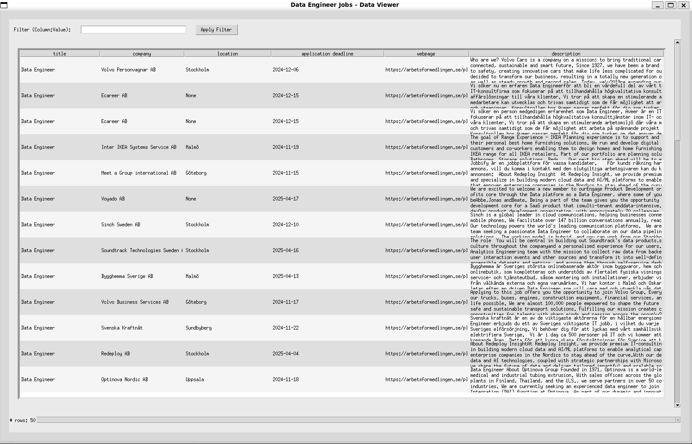

# Data Engineer Jobs

A project to gather job listings from the the Swedish Employment Agency. In this case job listings for Data Engineers.

The data gets pulled using the Swedish Employment Agencys API, gets transformed and stored in a SQL database file. The database file can be viewed with the data_viewer.

The program is scheduled to run once a week using the shell script and crontab.

The data_viewer displays a table using tkinter showing title, company, location, application deadline, webpage and description.
The urls in the webpage columns are clickable links to the joblisting.

## Usage

Run the <code>main.py</code> file to gather and store the data.  
Run the <code>data_viewer.py</code> file to view the data gathered.
The data_viewer can filter the data and save it as a csv-file.